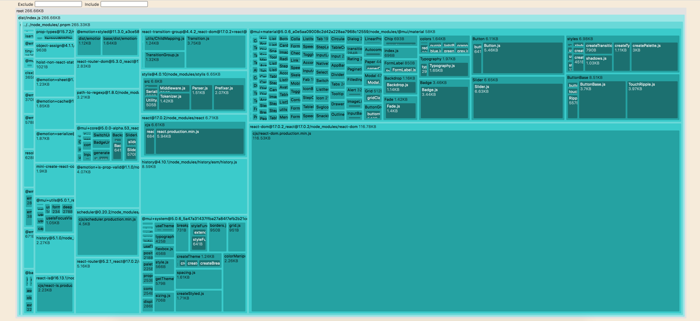

# React + react-router + material ui 

Example of building and running a react application splitting bundle by route.  


Also, use esbuild’s `metafile` to analyze bundle size.



## Getting started

1. Cloning the repo

2. Installation

```sh
// npm
npm install && npm run dev

// yarn 
yarn install && yarn dev

// pnpm 
pnpm install && pnpm dev
```

3. Serve the static files

```sh
http-server ./dist
```

4. Visit `localhost:8080/`

## References

For more options, and information please visit the [documentation](https://esbuild.github.io/api/#build-api).

### Useful links

- [bundling for the browser](https://esbuild.github.io/getting-started/#bundling-for-the-browser)
- [jsx](https://esbuild.github.io/content-types/#jsx)
- [splitting](https://esbuild.github.io/api/#splitting)
- [metafile](https://esbuild.github.io/api/#metafile)
- [esbuild-visualizer](https://github.com/btd/esbuild-visualizer)
